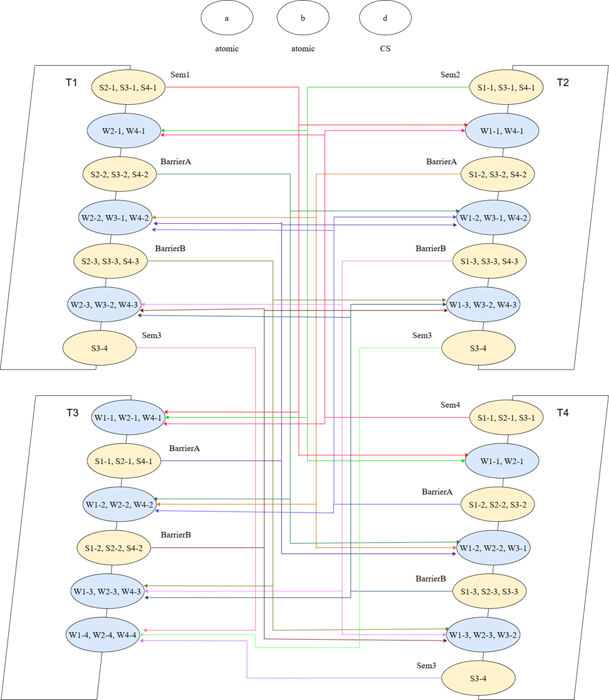
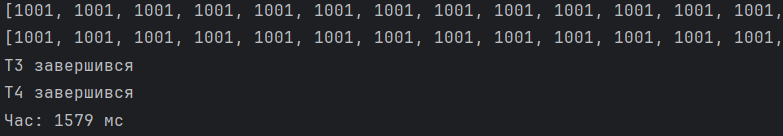
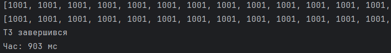

# Computing System

A program for solving a problem MA = min(Z) * MX + max(Z) * (MR * MC) * d in a parallel computer system with shared
memory.

## Technology stack

* **Language:** Java
* **Computation mechanisms:** Multithreading, Concurrency

## Data input and output distribution:

* **T1** - input of MC, Z
* **T2** - input of MX
* **T3** - output of MA
* **T4** - input of MR, d

## Thread interaction schema

    

## How to run the project

1. Clone the repository  
   `git clone https://github.com/andrfurs/computing-system.git`
2. Compile the project  
   `javac Main.java`
3. Run the application  
   `java Main`

## Program execution example

On 1 core:  

On 4 cores:  

Acceleration coefficient C = 1,749

---
***

# Обчислювальна система

Програма для вирiшення задачі MA = min(Z) * MX + max(Z) * (MR * MC) * d в паралельній комп’ютерній системі зі спільною
пам’яттю.

## Стек технологій

* **Мова:** Java
* **Механізми обчислень:** Multithreading, Concurrency

## Розподіл введення та виведення даних:

* **T1** - введення MC, Z
* **T2** - введення MX
* **T3** - виведення MA
* **T4** - введення MR, d

## Схема взаємодії потоків

    

## Як запустити проєкт

1. Клонуйте репозиторій  
   `git clone https://github.com/andrfurs/computing-system.git`
2. Скомпілюйте проєкт  
   `javac Main.java`
3. Запустіть програму  
   `java Main`

## Приклад виконання програми

На 1 ядрі:  

На 4 ядрах:  

Коефіцієнт прискорення K = 1,749